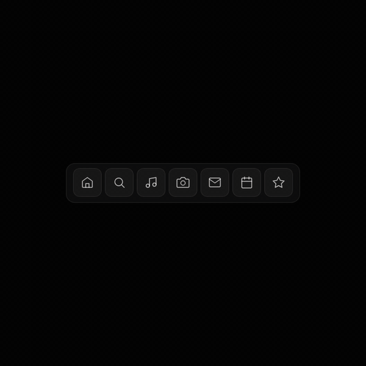

# Prism

<p align="center">
  <a href="https://prism.sammii.dev"></a>
</p>

<p align="center">
  <a href="https://prism.sammii.dev"></a>
  
  
  <a href="./LICENSE"></a>
</p>

**Cursor-reactive design engineering components.** Spring physics, zero runtime dependencies, one file per component. Every element responds chromatically to pointer position — components glow, borders shift, motion tracks where you are on the page.

→ **Live: [prism.sammii.dev](https://prism.sammii.dev)**

---

## What this is

A React component library where nothing is static. Move your cursor and colours shift across the viewport, borders pick up pastel tints from your pointer position, components lift and settle on spring curves. No CSS transitions, no framer-motion, no runtime dependencies at all — every motion system is hand-rolled with `requestAnimationFrame` and spring equations.

Built in public. One component a day. The library roadmap is 105 components over 15 weeks; this repo is where they land.

## Why it's different

Every component library ships static components. Even "animated" ones use fixed colours and predefined motion. Prism components are alive — they respond to where you are on the page. Move your cursor left: blues and purples. Right: pinks and corals. Every interaction is uniquely coloured by where you triggered it, because a shared `usePointer` hook broadcasts position to every component simultaneously.

| Library     | Components | Animated | Cursor-reactive      | Colour-mapped | Themeable palette |
|-------------|-----------:|:--------:|:--------------------:|:-------------:|:-----------------:|
| shadcn/ui   | 59         | no       | no                   | no            | yes (CSS vars)    |
| Radix       | 30         | no       | no                   | no            | no                |
| Aceternity  | 90+        | yes      | some                 | no            | no                |
| Magic UI    | 70+        | yes      | no                   | no            | no                |
| React Bits  | 135        | yes      | some                 | no            | no                |
| **Prism**   | **100+**   | **yes**  | **every component**  | **yes**       | **yes**           |

## Shipped so far

22 components, 5 experimental playgrounds. Every demo is a live route on the site.

**Components** — [animated-border](https://prism.sammii.dev/animated-border), [avatar](https://prism.sammii.dev/avatar), [floating-dock](https://prism.sammii.dev/floating-dock), [fluid-tooltip](https://prism.sammii.dev/fluid-tooltip), [glow-badge](https://prism.sammii.dev/glow-badge), [glow-checkbox](https://prism.sammii.dev/glow-checkbox), [glow-input](https://prism.sammii.dev/glow-input), [glow-select](https://prism.sammii.dev/glow-select), [glow-slider](https://prism.sammii.dev/glow-slider), [glow-textarea](https://prism.sammii.dev/glow-textarea), [hover-reveal](https://prism.sammii.dev/hover-reveal), [icon-button](https://prism.sammii.dev/icon-button), [magnetic-button](https://prism.sammii.dev/magnetic-button), [morph-tabs](https://prism.sammii.dev/morph-tabs), [progress-bar](https://prism.sammii.dev/progress-bar), [pulse-dot](https://prism.sammii.dev/pulse-dot), [ripple-button](https://prism.sammii.dev/ripple-button), [shimmer-text](https://prism.sammii.dev/shimmer-text), [skeleton](https://prism.sammii.dev/skeleton), [spotlight-card](https://prism.sammii.dev/spotlight-card), [spring-toggle](https://prism.sammii.dev/spring-toggle), [tilt-card](https://prism.sammii.dev/tilt-card)

**Playground** — [colour-field](https://prism.sammii.dev/colour-field), [fluid-mesh](https://prism.sammii.dev/fluid-mesh), [gravity-wells](https://prism.sammii.dev/gravity-wells), [shader-marbling](https://prism.sammii.dev/shader-marbling), [text-dissolve](https://prism.sammii.dev/text-dissolve)

Roadmap for the next 80+ is in [`COMPONENT-LIBRARY-PLAN.md`](./COMPONENT-LIBRARY-PLAN.md).

## The colour system

Position-mapped colour is the core primitive. A shared pointer hook broadcasts smoothed cursor coordinates, and every component samples colour from them through one of a small set of functions:

```ts
pastelColour(xPc, yPc, time)   // soft pastel RGB, floors at 140
cursorColour(xPc, yPc)         // vivid RGB
colourField(xPc, yPc, time)    // 4-blob ambient background gradient
colourBlend(xPc, yPc, opacity) // 3-circle vivid blend
usePointer({ lerp: 0.08 })     // smoothed cursor tracking hook
```

The range is currently the full spectrum. A `PrismProvider` with themeable palettes (ocean, sunset, neon, monochrome, custom) is on the roadmap — see [`COMPONENT-LIBRARY-PLAN.md`](./COMPONENT-LIBRARY-PLAN.md).

## Design principles

1. **Every component reacts to the cursor.** No static elements. Even subtle ones (badge, separator) have micro-reactions.
2. **Spring physics, not CSS transitions.** `requestAnimationFrame` + hand-rolled spring equations. Overshoot, settle, bounce.
3. **Zero runtime dependencies.** No framer-motion, no cmdk, no Radix. One file per component, each ~100–300 lines.
4. **Works without colour.** Every component is fully functional with the reactive colour disabled. Colour is an enhancement layer, not a dependency.
5. **Records well.** Every component must look striking in a 12-second square screen recording. If it doesn't hook the eye in three seconds, it isn't finished.
6. **Dark-first.** `#050505` background, luminous pastel accents. The colour is the decoration.

## Autonomous pipeline

Prism is built by a chain of agents that runs daily without me:

```
scout → curator → builder → recorder → publisher
```

- **scout** (Haiku + Chrome MCP) browses X for interaction patterns and UI ideas
- **curator** (Sonnet) picks the day's component from live registry state, writes a build brief targeted at category gaps
- **builder** (Sonnet) writes the component file, demo, and registry entry, verifies lint + build
- **recorder** (Playwright + ffmpeg) records a 12-second 1080×1080 mp4 with an organic cursor path
- **publisher** (Haiku) uploads the video and schedules the X post via Spellcast

```bash
./pipeline/orchestrator.sh auto              # scout → curator → builder → record → publish
./pipeline/orchestrator.sh inspire           # scout + curator only (get today's brief)
./pipeline/orchestrator.sh build             # build from an existing brief
./pipeline/orchestrator.sh record <slug>     # just re-record a component
./pipeline/orchestrator.sh status            # pipeline + queue state
```

The library you browse is largely written by agents. I review, land, polish, and ship.

## Architecture

```
app/
  page.tsx                  Gallery index
  [slug]/page.tsx           Dynamic component route (explicit componentMap for Turbopack)
  atoms/page.tsx            All primitives rendered together
  lib/
    registry.ts             Component/playground metadata
    primitives/
      gradient.ts           colourField, colourBlend, cursorColour, pastelColour
      cursor-glow.tsx       Lerp-smoothed cursor glow
      spotlight-card.tsx    Reactive pastel border card
    hooks/use-pointer.ts    Shared smoothed pointer hook
    components/<slug>.tsx   Each component, one file, named export + props interface
  demos/<slug>.tsx          Demo page per component
  playground/<slug>.tsx     Visual experiments
pipeline/
  orchestrator.sh           Shell orchestrator
  agents/*.json             Per-agent Claude + MCP configs
scripts/
  record.ts                 Playwright screen recorder
```

## Local dev

```bash
pnpm install
pnpm dev                    # http://localhost:3000
pnpm lint
pnpm build
```

Screen record any component:

```bash
npx tsx scripts/record.ts <slug> [duration_seconds]
# outputs to recordings/<slug>.mp4 — requires ffmpeg
```

## NPM package

`@sammii/prism-ui` is scaffolding. Distribution will be shadcn-style CLI (`npx @sammii/prism-ui add <component>`) with traditional imports as the secondary path. Tailwind v4 preset, ESM-only, `"sideEffects": false`, zero runtime deps. Copy-paste from the repo for now.

## Built by

**Sammii Kellow** — design engineer. London.

- Portfolio: [sammii.dev](https://sammii.dev)
- X: [@sammiihk](https://x.com/sammiihk)
- GitHub: [Sammii-HK](https://github.com/Sammii-HK)

## License

MIT. Copy, fork, remix.
